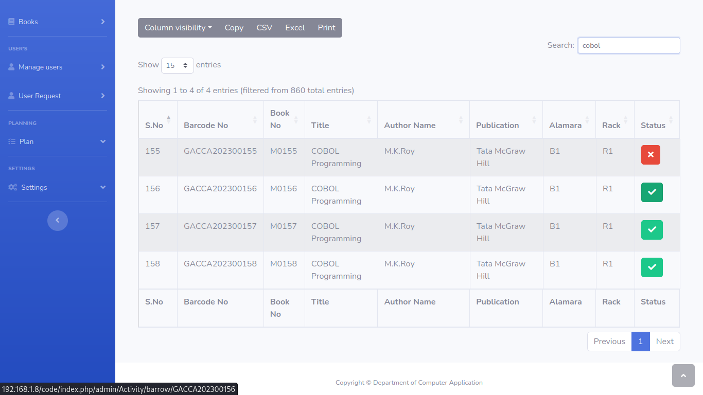

<h1>Library management system version 2</h1>

<strike><h3>Under development...!</h3></strike>

We are using to CodeIgniter 4 Framework

- first time need to be run composer🪗(install composer from offical <a href="https://getcomposer.org/">site</a>)

        composer update

- config(Edit, Like DataBase, ENVIRONMENT) .env file,in your favorite editer

Library management system version-1 avaliable <a href="https://github.com/virtualheart/LMS">here </a>
 (V1 based on core PHP)
 

<b>Images</b>

   
Image 1

   

   
Image 2

   

   
Image 3

   

   
Image 4

   

   
Image 5

   

   
Image 6

   

   
Image 7

   

   
Image 8

   

   
Image 9

   

   
Image 10

   

   
Image 11

   

   
Image 12

   

   
Image 13

   

   
Image 14

   

   
Image 15

   

   
Image 16

   

   
Image 17

   

   
Image 18

   

   
Image 19

   

   
Image 20

   

 <b>Thanks</b>
 
 Template by 🙏 Start Bootstrap - <a href="https://startbootstrap.com/theme/sb-admin-2/">SB Admin 2</a>.
 
 contributors(Welcome to spot my mistake and error's😇).
